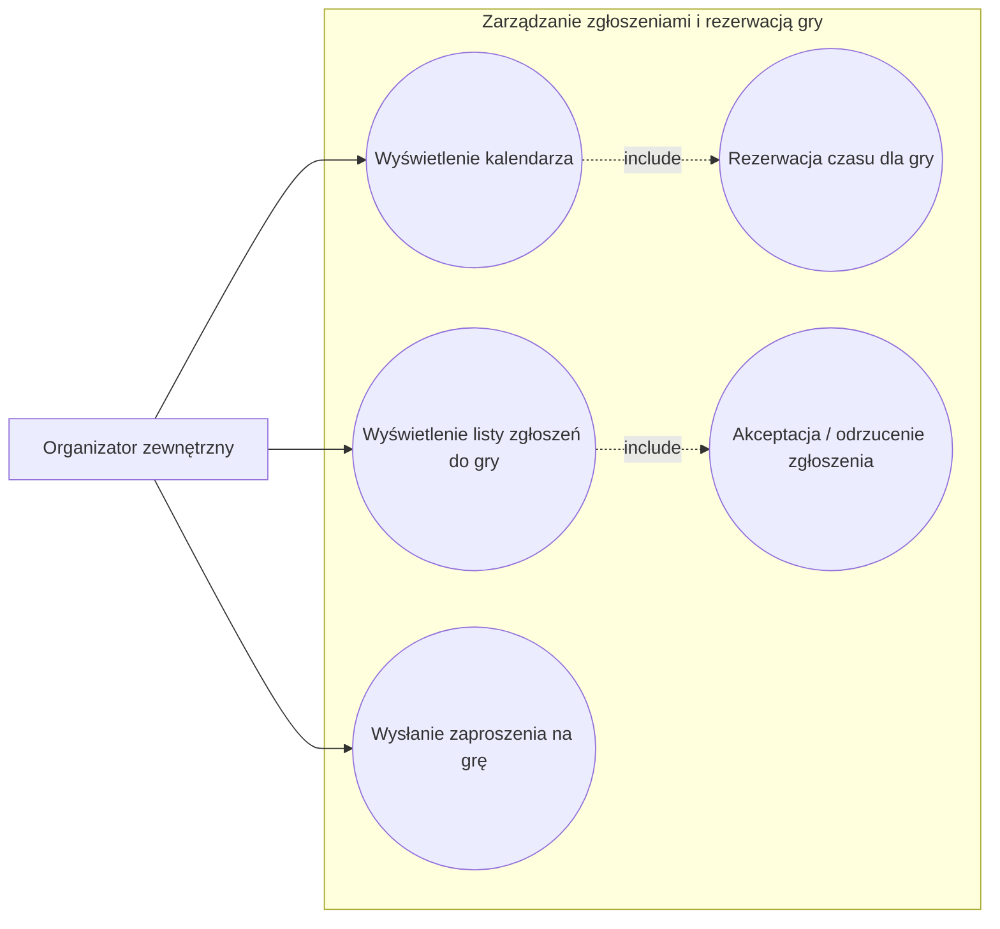

```mermaid
flowchart LR

organizator["Organizator zewnętrzny"]

subgraph "Zarządzanie zgłoszeniami i rezerwacją gry"

UC1(("Wyświetlenie kalendarza"))
UC2(("Rezerwacja czasu dla gry"))
UC3(("Wyświetlenie listy zgłoszeń do gry"))
UC4(("Akceptacja / odrzucenie zgłoszenia"))
UC5(("Wysłanie zaproszenia na grę"))

UC1 -. include .-> UC2
UC3 -. include .-> UC4

end

organizator --> UC1
organizator --> UC3
organizator --> UC5

```
