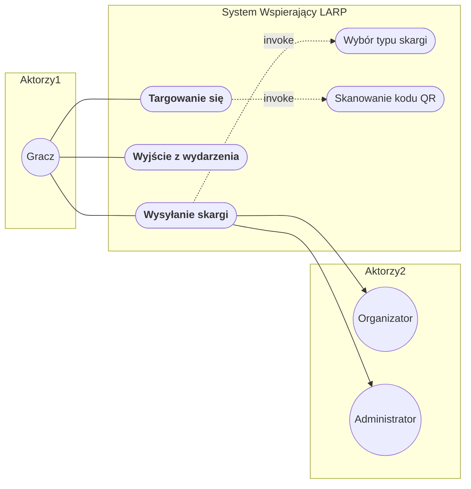

```mermaid
flowchart LR

%% ===== AKTORZY1 =====
subgraph Aktorzy1
    Gracz((Gracz))
end

%% ===== AKTORZY2 =====
subgraph Aktorzy2
    Org((Organizator))
    Admin((Administrator))
end

%% ===== SYSTEM =====
subgraph System_LARP [System Wspierający LARP]
    %% Przypadki użycia
    PU_Skarga([<b>Wysyłanie skargi</b>])
    PU_Wyjscie([<b>Wyjście z wydarzenia</b>])
    PU_Targowanie([<b>Targowanie się</b>])
    
    %% Relacje wewnątrz systemu
    PU_Skarga -.->|invoke| PU_Typ([Wybór typu skargi])
    PU_Targowanie -.->|invoke| PU_QR([Skanowanie kodu QR])
end

%% ===== POWIĄZANIA =====
Gracz --- PU_Skarga
Gracz --- PU_Wyjscie
Gracz --- PU_Targowanie

PU_Skarga --> Org
PU_Skarga --> Admin
```
