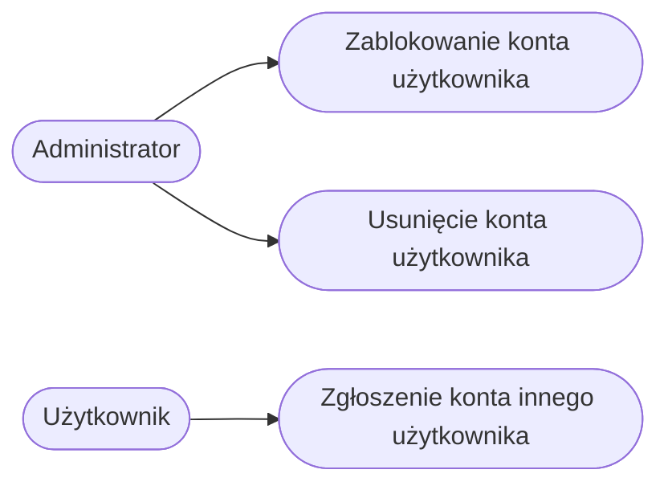

```mermaid
flowchart LR
    Admin(["Administrator"])
    User(["Użytkownik"])

    uc1(["Zablokowanie konta użytkownika"])
    uc2(["Usunięcie konta użytkownika"])
    uc3(["Zgłoszenie konta innego użytkownika"])

    Admin --> uc1
    Admin --> uc2
    User --> uc3
```
