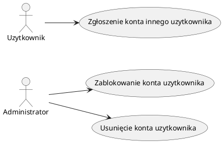

```plantuml
@startuml
left to right direction

"Zablokowanie konta uzytkownika" as (uc1)
"Usunięcie konta uzytkownika" as (uc2)
"Zgłoszenie konta innego uzytkownika" as (uc3)

:Administrator: --> (uc1)
:Administrator: --> (uc2)
:Uzytkownik: --> (uc3)

@enduml
```
