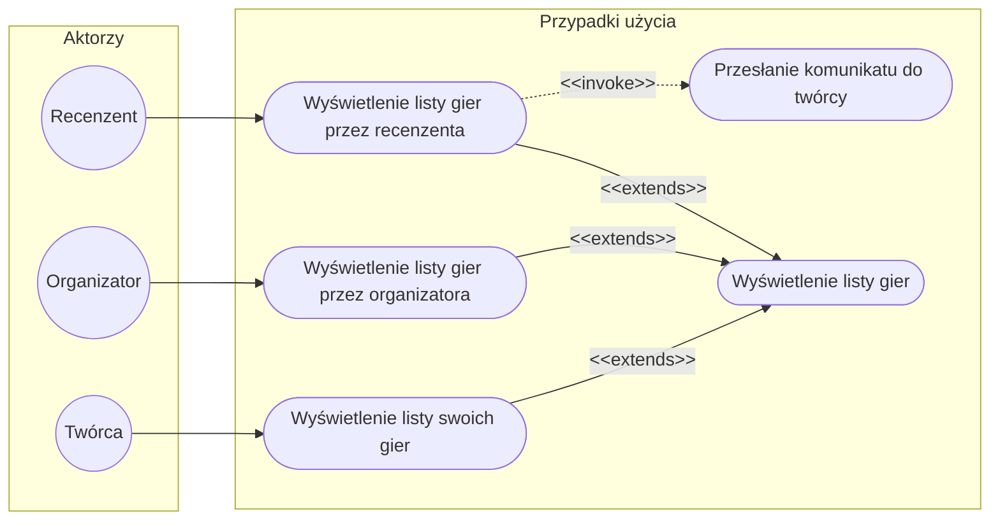

# Opisy przypadków użycia

## Przesłanie komunikatu do twórcy

Recenzent powinien być w stanie przesłać komunikaty do twórcy gry z poziomu gry. 

## Wyświeltenie listy swoich gier

Twórca jest w stanie wyświetlić listę gier, których jest autorem.
Z widoku listy powinien być w stanie wejść w tryby edycji i statystyk dotyczących danej gry.

## Wyświetlenie listy gier przez organizatora

Organizator jest w stanie wyświetlić listę gier możliwych do organizacji. Organizator może z tego miejsca wyświetlić sczegóły gry, oraz rozpocząć jej organizację.

## Wyświetlenie listy gier przez recenzenta

Recenzent jest w stanie wyświetlić nie opublikowane gry, które zostały przypisane mu do zrecenzowania. 
Recenzent może dalej przejść w tryb wyświetlenia gry, a następnie komunikatu lub dopuszczenia do publikacji gry.

## Wyświetlenie listy gier
Usecase abstrakcyjny, określający wyświetlenie listy. Podstawowe funkcje to filtrowanie i wyszukiwanie. 

# Wymagania funkcjonalne

## czas dostarczenia komunikatu do twórcy

Komunikat do twórcy przychodzi z opóźnieniem max 30 minut.

# Słownik dziedziny

- **Twórca**/**Twórca gry** - Osoba, która jest autorem, lub jednym z autorów gry w naszym serwisie

- **Gra** - Plan rozgrywki typu LARP zapisana w naszym serwisie. Jedna gra może być organizowana wielokrotnie.

- **Organizator** - Osoba odpowiedzialna za organizację rozgrywki gry LARP.

- **Recenzent** - Osoba odpowiedzialna za wstępną recenzję wydarzenia. Komunikuje swoje uwagi twórcy. Jest odpowiedzialny za ostateczne opublikowanie gry.
